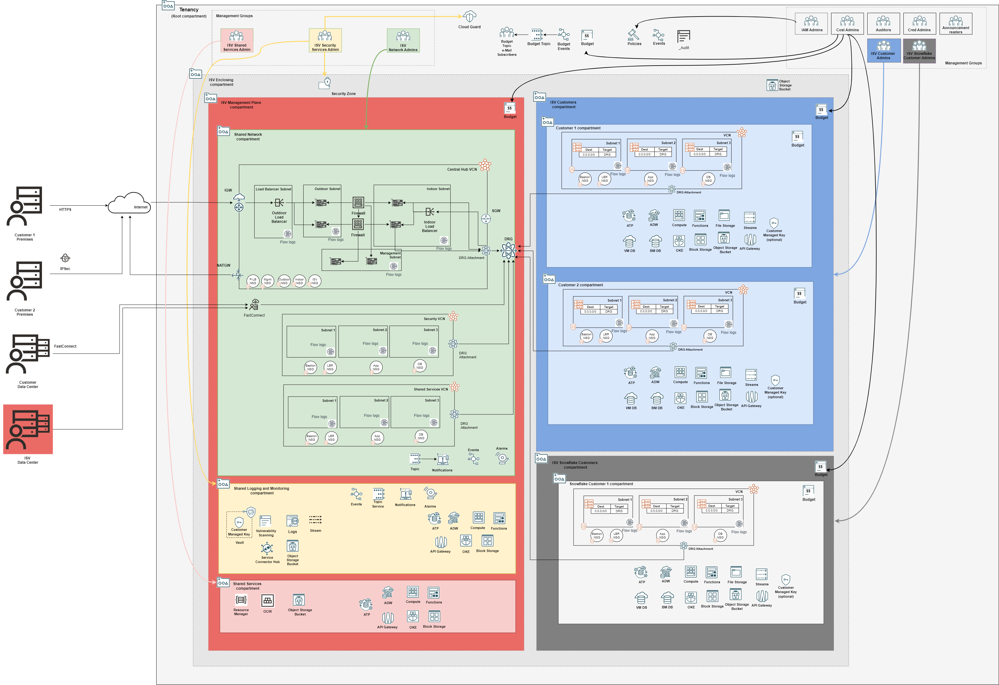

# ISV Landing Zone Architecture POD Model Blueprint

## Introduction

This repository contains the configuration files for OCI ISV Landing Zone Architecture POD Model Blueprint, which is based on OCI Core Landing Zone (formerly known as OCI CIS Landing Zone) principles. In the POD model, each ISV customer gets its own copy of the application.

The architecture diagram below depicts the single tenancy blueprint, clearly separating the ISV management plane (magenta color) from ISV customers (grey and dark pink colors) compartments.

### Management Plane

### Customers

### Management Groups

### Root Level Resources

[Click here](./images/isv-pod-architecture.drawio) to download the drawio version.

## Configuration Files

The blueprint is described in configuration files (JSON documents) that can be deployed as-is or changed based on specific requirements. Changes must be done following the requirements and specifications of the respective underlying Terraform module. The idea behind describing Landing Zones as JSON documents is making them fully customizable and declarable in a standard and widespread document format (JSON), while leveraging Terraform's Infrastructure as Code paradigm.

The configuration files are organized in different folders, according to the broader area they belong. The folder structure is the following:

- mgmt-plane: a top level folder for management plane, management groups and Root level resources.
    - iam: 
        - [iam_config.json](./mgmt-plane/iam/iam_config.json), with the IAM configuration, including compartments, groups and policies.
    - governance: 
        - [budgets_config.json](./mgmt-plane/governance/budgets_config.json), with budgets configuration.
    - security: 
        - [cloud_guard_config.json](./mgmt-plane/security/cloud_guard_config.json), with Cloud Guard configuration.
        - [scanning_config.json](./mgmt-plane/security/scanning_config.json), with scanning configuration.
    - observability: 
        - [observability_config.json](./mgmt-plane/observability/observability_config.json), with logging, streams, notifications, events, alarms and service connector hub configurations.
    - network: 
        - [network_initial_config.json](./mgmt-plane/network/network_initial_config.json), containing the initial network configuration, with VCNs, subnets, route tables, security lists, network security groups, VCN gateways and DRG.
        - [network_post_firewall_config.json](./mgmt-plane/network/network_post_firewall_config.json), adding route table rule to Network Load Balancer private IP and DRG attachments to the initial network configuration. This configuration is to be executed after the Firewall appliance and OCI Network Load Balancer are provisioned.
        - [network_post_each_customer_config.json](./mgmt-plane/network/network_post_each_customer_config.json), adding route table rules and DRG route table distributions for each on-boarded customer. This configuration is to be executed after each customer onboarding.
    - firewall: [firewall_config.json](./mgmt-plane/firewall/firewall_config.json), with firewall appliance and OCI Network Load Balancer configurations.

- customers: a top level folder for each customer configuration.
    - customer1: [customer1_config.json](./customers/customer1/customer1_config.json), with all resource configurations for customer 1, including IAM and networking.

## How to Deploy

The blueprint (or any customization) configurations can be deployed in separate stacks. A stack is a set of configurations that are managed by a single Terraform execution and thus reflected in a single Terraform state file. The decision factor for how many stacks depends on how the organization wants to manage the environment, especially which roles are expected to deploy which parts of the blueprint. 

As a rule of thumb, it is advisable to separate management place stacks from customer stacks. They must be executed in the following order:

1. **Management plane foundational stack**: assembled with *iam_config.json*, *budgets_config.json*, *cloud_guard_config.json*, *scanning_config.json* and *observability_config.json* configuration files. It can be further split based on specific requirements.
2. **Management plane network stack**: composed by *network_initial_config.json*, later replaced by *network_post_firewall_config.json* after firewall provisioning, and later replaced by *network_post_each_customer_config.json* after each customer stack.
3. **Management plane firewall stack**: composed by *firewall_config.json*, after which the Management plane network stack must be updated with *network_post_firewall_config.json*.
4. **Customer stacks**: composed by *customer?_config.json*, after which the Management plane network stack must be updated with *network_post_each_customer_config.json*.

### The OCI Landing Zones Orchestrator

The [OCI Landing Zones Orchestrator](https://github.com/oracle-quickstart/terraform-oci-landing-zones-orchestrator) is the tool for deploying JSON-based landing zones. The orchestrator also supports YAML documents or Terraform tfvars files with HCL (Hashicorp Language) objects. The only requirement is that the documents/HCL objects are defined according to the requirements and specifications set forth by the OCI Landing Zone core modules, that are available in the following repositories:

- [Identity & Access Management](https://github.com/oracle-quickstart/terraform-oci-cis-landing-zone-iam)
- [Networking](https://github.com/oracle-quickstart/terraform-oci-cis-landing-zone-networking)
- [Governance](https://github.com/oracle-quickstart/terraform-oci-cis-landing-zone-governance)
- [Security](https://github.com/oracle-quickstart/terraform-oci-cis-landing-zone-security)
- [Observability & Monitoring](https://github.com/oracle-quickstart/terraform-oci-cis-landing-zone-observability)
- [Secure Workloads](https://github.com/oracle-quickstart/terraform-oci-secure-workloads)

