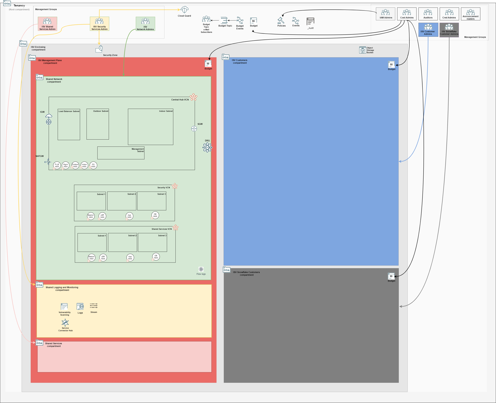
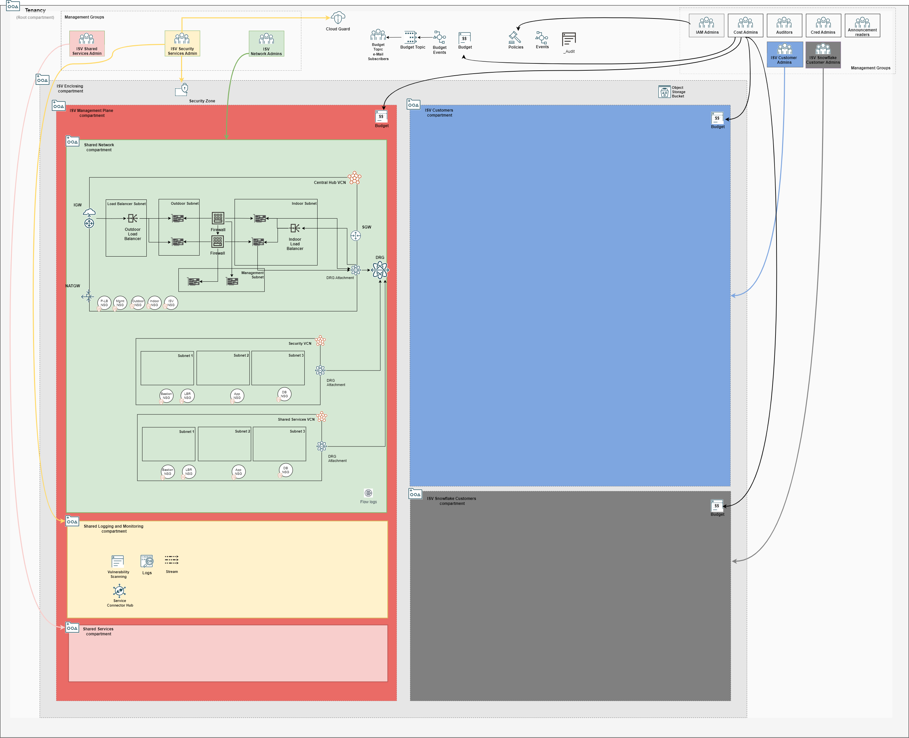

# ISV Landing Zone Architecture POD Model Blueprint

## Introduction

This repository contains the configuration files for OCI ISV Landing Zone Architecture POD Model Blueprint, which is based on OCI Core Landing Zone (formerly known as OCI CIS Landing Zone) principles. In the POD model, each ISV customer gets its own copy of the application.

The architecture diagram below depicts the single tenancy blueprint, clearly separating the ISV management plane (red color) from ISV customers (blue and grey) compartments.

### Management Plane

### Customers

### Management Groups

### Root Level Resources

[Click here](./images/isv-pod-architecture.drawio) to download the drawio version.

## Configuration Files

The blueprint is described in configuration files (JSON documents) that can be deployed as-is or changed based on specific requirements. Changes must be done following the requirements and specifications of the respective underlying Terraform module. The idea behind describing Landing Zones as JSON documents is making them fully customizable and declarable in a standard and widespread document format (JSON), while leveraging Terraform's Infrastructure as Code paradigm.

The configuration files are organized in different folders, according to the broader area they belong. The folder structure is the following:

- mgmt-plane: a top level folder for management plane, management groups and Root level resources.
    - bootstrap:
        - [bootstrap.json](./mgmt-plane/bootstrap/bootstrap.json), containing an OCI private bucket allowing for the automation of the composite deployment model. The bucket stores the dependency files that are produced and consumed by the different stacks. 
    - iam: 
        - [iam_config.json](./mgmt-plane/iam/iam_config.json), with the IAM configuration, including compartments, groups and policies.
    - governance: 
        - [budgets_config.json](./mgmt-plane/governance/budgets_config.json), with budgets configuration.
    - security: 
        - [cloud_guard_config.json](./mgmt-plane/security/cloud_guard_config.json), with Cloud Guard configuration.
        - [scanning_config.json](./mgmt-plane/security/scanning_config.json), with scanning configuration.
    - observability: 
        - [observability_config.json](./mgmt-plane/observability/observability_config.json), with logging, streams, notifications, events, alarms and service connector hub configurations.
    - network: 
        - [network_initial_config.json](./mgmt-plane/network/network_initial_config.json), containing the initial network configuration, with VCNs, subnets, route tables, security lists, network security groups, VCN gateways and DRG.
        - [network_post_firewall_config.json](./mgmt-plane/network/network_post_firewall_config.json), adding route table rule to Network Load Balancer private IP and DRG attachments to the initial network configuration. This configuration is to be executed after the Firewall appliance and OCI Network Load Balancer are provisioned.
        - [network_post_each_customer_config.json](./mgmt-plane/network/network_post_each_customer_config.json), adding route table rules and DRG route table distributions for each on-boarded customer. This configuration is to be executed after each customer onboarding.
    - firewall: [firewall_config.json](./mgmt-plane/firewall/firewall_config.json), with firewall appliance and OCI Network Load Balancer configurations.

- customers: a top level folder for each customer configuration.
    - customer1: [customer1_config.json](./customers/customer1/customer1_config.json), with all resource configurations for customer 1, including IAM and networking.

These configuration files are designed to be used as templates, owned and modified at will by customers that are deploying the model.

## How to Deploy

The blueprint (or any customization) configurations can be deployed in separate stacks. A stack is a set of configurations that are managed by a single Terraform execution and thus reflected in a single Terraform state file. The decision factor for how many stacks depends on how the organization wants to manage the environment, especially which roles are expected to deploy which parts of the blueprint. 

### The OCI Landing Zones Orchestrator

The [OCI Landing Zones Orchestrator](https://github.com/oracle-quickstart/terraform-oci-landing-zones-orchestrator) is a convenience tool for deploying JSON-based landing zones. It also supports YAML documents or Terraform tfvars files with HCL (Hashicorp Language) objects. The only requirement is that the documents/HCL objects are defined according to the requirements and specifications set forth by the OCI Landing Zone core modules, that are available in the following repositories:

- [Identity & Access Management](https://github.com/oracle-quickstart/terraform-oci-cis-landing-zone-iam)
- [Networking](https://github.com/oracle-quickstart/terraform-oci-cis-landing-zone-networking)
- [Governance](https://github.com/oracle-quickstart/terraform-oci-cis-landing-zone-governance)
- [Security](https://github.com/oracle-quickstart/terraform-oci-cis-landing-zone-security)
- [Observability & Monitoring](https://github.com/oracle-quickstart/terraform-oci-cis-landing-zone-observability)
- [Secure Workloads](https://github.com/oracle-quickstart/terraform-oci-secure-workloads)

Next we show how to deploy the blueprint as separate stacks with the Orchestrator.

The "Deploy to Oracle Cloud" buttons create the stacks with all variables already pre-filled.

**Stacks 1-4 are executed once. After stack 4, the network and firewall are configured to onboard customers. Stacks 5-6 must be repeated for each new customer onboarding.**

### 1. Management Plane Foundational Stack Deployment

The foundational stack assembles bootstrap, IAM, governance, security and observability configuration files in a single configuration. As mentioned before, it can be further split depending on deployment requirements. 

Input Configuration Files | Input Dependency Files | Output
--------------------------|------------------------|-------
[bootstrap.json](./mgmt-plane/bootstrap/bootstrap.json), [iam_config.json](./mgmt-plane/iam/iam_config.json), [budgets_config.json](./mgmt-plane/governance/budgets_config.json), [scanning_config.json](./mgmt-plane/security/scanning_config.json), [observability_config.json](./mgmt-plane/observability/observability_config.json) | None | iam/output/compartments_output.json

[](https://cloud.oracle.com/resourcemanager/stacks/create?zipUrl=https://github.com/oracle-quickstart/terraform-oci-landing-zones-orchestrator/archive/refs/heads/urls-dep-source.zip&zipUrlVariables={"input_config_files_urls":"https://raw.githubusercontent.com/andrecorreaneto/oci-landing-zone-configuration/test/mgmt-plane/bootstrap/bootstrap.json,https://raw.githubusercontent.com/andrecorreaneto/oci-landing-zone-configuration/test/mgmt-plane/iam/iam_config.json,https://raw.githubusercontent.com/andrecorreaneto/oci-landing-zone-configuration/test/mgmt-plane/governance/budgets_config.json,https://raw.githubusercontent.com/andrecorreaneto/oci-landing-zone-configuration/test/mgmt-plane/observability/observability_config.json,https://raw.githubusercontent.com/andrecorreaneto/oci-landing-zone-configuration/test/mgmt-plane/security/scanning_config.json","url_dependency_source_oci_bucket":"isv-terraform-runtime-bucket","url_dependency_source":"ocibucket","save_output":true,"oci_object_prefix":"iam/output"})

### 2. Management Plane Network Stack Deployment - Initial Configuration

The network stack deploys the initial network configuration, containing the management plane VCNs and a DRG. At this stage, there are not DRG attachments.

Input Configuration Files | Input Dependency Files | Output
--------------------------|------------------------|-------
[network_initial_config.json](./mgmt-plane/network/network_initial_config.json) | iam/output/compartments_output.json | network/output/network_output.json

[](https://cloud.oracle.com/resourcemanager/stacks/create?zipUrl=https://github.com/oracle-quickstart/terraform-oci-landing-zones-orchestrator/archive/refs/heads/urls-dep-source.zip&zipUrlVariables={"input_config_files_urls":"https://raw.githubusercontent.com/andrecorreaneto/oci-landing-zone-configuration/test/mgmt-plane/network/network_initial_config.json","url_dependency_source_oci_bucket":"isv-terraform-runtime-bucket","url_dependency_source":"ocibucket","url_dependency_source_oci_objects":"iam/output/compartments_output.json","save_output":true,"oci_object_prefix":"network/output"})

### 3. Management Plane Firewall Stack Deployment

The firewall stack deploys a pair of Palo Alto firewalls, *sandwiched* by a pair of OCI network load balancers. 

Input Configuration Files | Input Dependency Files | Output
--------------------------|------------------------|-------
[firewall_config.json](./mgmt-plane/firewall/firewall_config.json) | iam/output/compartments_output.json, network/output/network_output.json  | firewall/output/instances_output.json

[](https://cloud.oracle.com/resourcemanager/stacks/create?zipUrl=https://github.com/oracle-quickstart/terraform-oci-landing-zones-orchestrator/archive/refs/heads/urls-dep-source.zip&zipUrlVariables={"input_config_files_urls":"https://raw.githubusercontent.com/andrecorreaneto/oci-landing-zone-configuration/test/mgmt-plane/firewall/firewall_config.json","url_dependency_source_oci_bucket":"isv-terraform-runtime-bucket","url_dependency_source":"ocibucket","url_dependency_source_oci_objects":"iam/output/compartments_output.json,network/output/network_output.json","save_output":true,"oci_object_prefix":"firewall/output"})

### 4. Management Plane Network Stack Deployment - Post Firewall Configuration

**This is not a new stack. It is an update to "2. Management Plane Network Stack Deployment - Initial Configuration"**

It updates the initial network configuration with route rules to the firewall and DRG attachments in the Central Hub VCN. 

Input Configuration Files | Input Dependency Files | Output
--------------------------|------------------------|-------
[network_post_firewall_config.json](./mgmt-plane/network/network_post_firewall_config.json) | iam/output/compartments_output.json, firewall/output/instances_output.json  | network/output/network_output.json

**At this stage the network is considered fully configured to onboard customers.**

### 5a. Customer 1 Stack Deployment

A customer stack deploys IAM, budget and network configuration for one customer. It initiates the onboarding process of a customer into the tenancy. Each customer is expected to have its own stack.

[](https://cloud.oracle.com/resourcemanager/stacks/create?zipUrl=https://github.com/oracle-quickstart/terraform-oci-landing-zones-orchestrator/archive/refs/heads/urls-dep-source.zip&zipUrlVariables={"input_config_files_urls":"https://raw.githubusercontent.com/andrecorreaneto/oci-landing-zone-configuration/test/mgmt-plane/customers/customer1/customer1_config.json","url_dependency_source_oci_bucket":"isv-terraform-runtime-bucket","url_dependency_source":"ocibucket","url_dependency_source_oci_objects":"iam/output/compartments_output.json,network/output/network_output.json","save_output":true,"oci_object_prefix":"customer1/output"})

### 6a. Management Plane Network Stack Deployment - Post Customer 1 Onboarding Configuration

**This is not a new stack. It is an update to "4. Management Plane Network Stack Deployment - Post Firewall Configuration" and must be executed after each customer deployment.**

It updates the DRG for routing traffic between the newly customer VCN and the firewall. 

[ ADD CONFIGURATION SNIPPET TO CENTRAL HUB DRG ATTACHMENT ]

Input Configuration Files | Input Dependency Files | Output
--------------------------|------------------------|-------
[network_post_each_customer_config.json](./mgmt-plane/network/network_post_each_customer_config.json) | iam/output/compartments_output.json, firewall/output/instances_output.json, customer1/output/network_output.json | network/output/network_output.json

### 5b. Customer 2 Stack Deployment

This is another customer sample stack.

[](https://cloud.oracle.com/resourcemanager/stacks/create?zipUrl=https://github.com/oracle-quickstart/terraform-oci-landing-zones-orchestrator/archive/refs/heads/urls-dep-source.zip&zipUrlVariables={"input_config_files_urls":"https://raw.githubusercontent.com/andrecorreaneto/oci-landing-zone-configuration/test/mgmt-plane/customers/customer1/customer2_config.json","url_dependency_source_oci_bucket":"isv-terraform-runtime-bucket","url_dependency_source":"ocibucket","url_dependency_source_oci_objects":"iam/output/compartments_output.json,network/output/network_output.json","save_output":true,"oci_object_prefix":"customer2/output"})

### 6b. Management Plane Network Stack Deployment - Post Customer 2 Onboarding Configuration

**This is not a new stack. It is an update to "6a. Management Plane Network Stack Deployment - Post Customer 1 Onboarding Configuration" and must be executed after each customer deployment.**

It updates the DRG for routing traffic between the newly customer VCN and the firewall. 

[ ADD CONFIGURATION SNIPPET TO CENTRAL HUB DRG ATTACHMENT ]

Input Configuration Files | Input Dependency Files | Output
--------------------------|------------------------|-------
[network_post_each_customer_config.json](./mgmt-plane/network/network_post_each_customer_config.json) | iam/output/compartments_output.json, firewall/output/instances_output.json, customer1/output/network_output.json, customer2/output/network_output.json | network/output/network_output.json