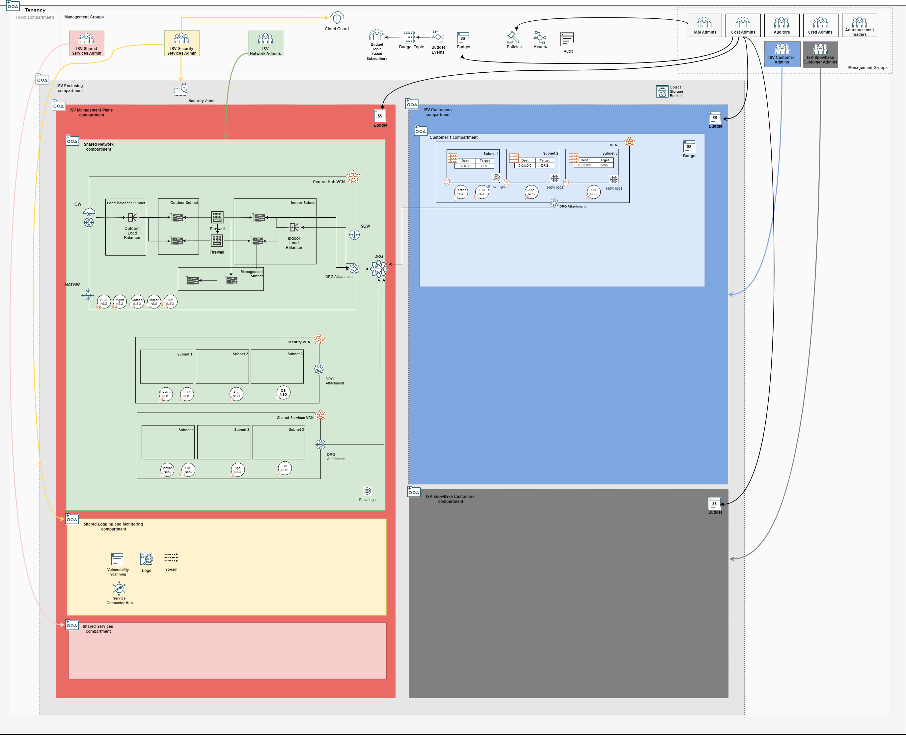

## Customer Onboarding Stack Deployment

A stack that deploys IAM, budget and network configuration for one customer. It initiates the onboarding process of a customer into the tenancy. Each customer is expected to have its own stack. 

### Typically Deployed By

Customers administrators.

### Deployment Order

This stack is executed after the [2nd stage deployment of the Management Plane Network Stack](./MPLANE-NETWORKING.md#2nd-stage).

### Stack Configuration

Input Configuration Files | Input Dependency Files | Output
--------------------------|------------------------|-------
[customer1_config.json](../mgmt-plane/customers/customer1/customer1_config.json) | iam/output/compartments_output.json, network/output/network_output.json  | customer1/output/instances_output.json

### Stack Creation

[](https://cloud.oracle.com/resourcemanager/stacks/create?zipUrl=https://github.com/oracle-quickstart/terraform-oci-landing-zones-orchestrator/archive/refs/heads/urls-dep-source.zip&zipUrlVariables={"input_config_files_urls":"https://raw.githubusercontent.com/andrecorreaneto/oci-landing-zone-configuration/test/mgmt-plane/customers/customer1/customer1_config.json","url_dependency_source_oci_bucket":"isv-terraform-runtime-bucket","url_dependency_source":"ocibucket","url_dependency_source_oci_objects":"iam/output/compartments_output.json,network/output/network_output.json","save_output":true,"oci_object_prefix":"customer1/output"})

### What Gets Deployed

