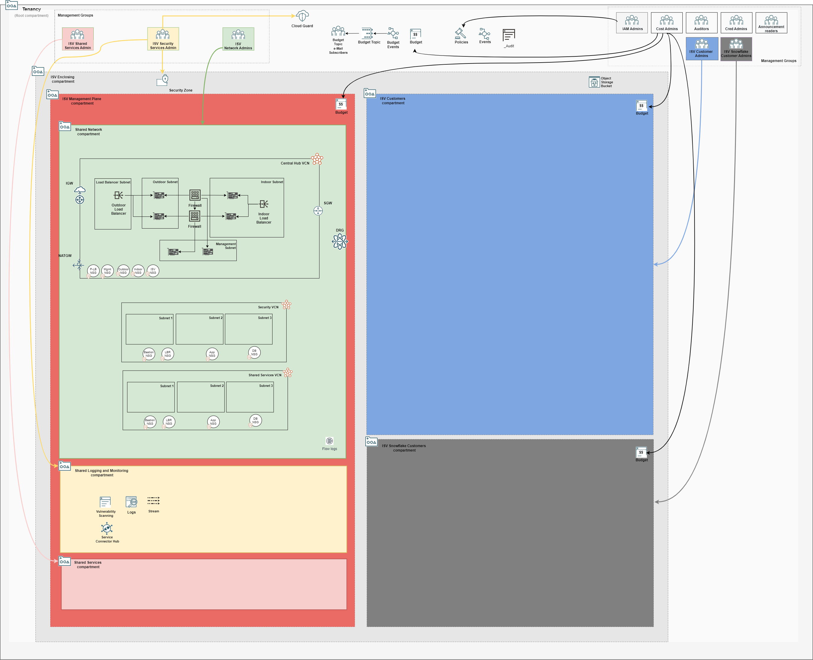

## Management Plane Firewall Stack Deployment

The firewall stack deploys a pair of Palo Alto firewalls, *sandwiched* by a pair of OCI network load balancers. 

### Typically Deployed By

Management plane network administrators.

### Deployment Order

This stack is executed after the initial deployment of the [Management Plane Network Stack](./MPLANE-NETWORKING.md#1st-stage).

### Stack Configuration

Input Configuration Files | Input Dependency Files | Output
--------------------------|------------------------|-------
[firewall_config.json](../mgmt-plane/firewall/firewall_config.json) | iam/output/compartments_output.json, network/output/network_output.json  | firewall/output/instances_output.json

### Stack Creation

[](https://cloud.oracle.com/resourcemanager/stacks/create?zipUrl=https://github.com/oracle-quickstart/terraform-oci-landing-zones-orchestrator/archive/refs/heads/urls-dep-source.zip&zipUrlVariables={"input_config_files_urls":"https://raw.githubusercontent.com/andrecorreaneto/oci-landing-zone-configuration/test/mgmt-plane/firewall/firewall_config.json","url_dependency_source_oci_bucket":"isv-terraform-runtime-bucket","url_dependency_source":"ocibucket","url_dependency_source_oci_objects":"iam/output/compartments_output.json,network/output/network_output.json","save_output":true,"oci_object_prefix":"firewall/output"})

### What Gets Deployed

