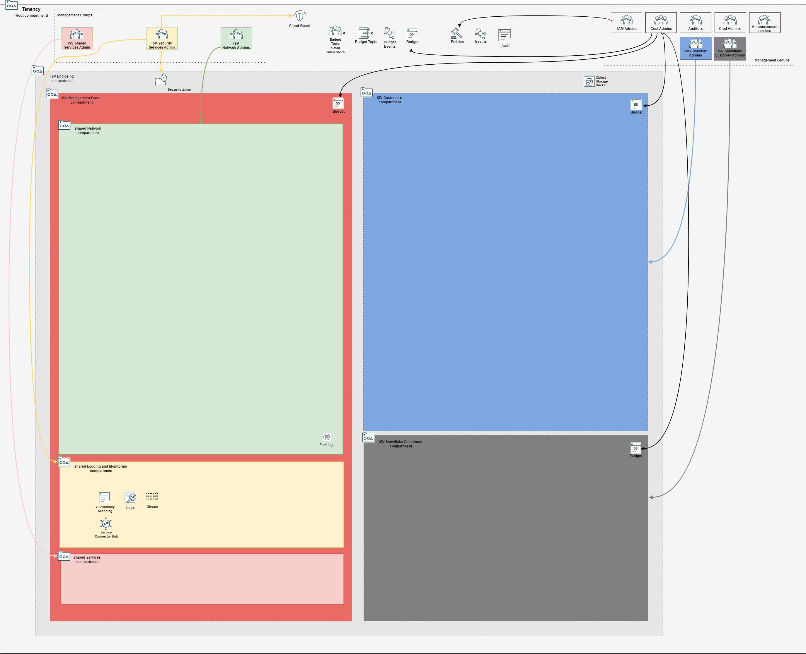

## Management Plane Foundational Stack Deployment

It assembles bootstrap, IAM, governance, security and observability configuration files in a single stack. 

### Typically Deployed By

Management plane administrators.

### Deployment Order

This is the very first stack to deploy.

### Stack Configuration

Input Configuration Files | Input Dependency Files | Output
--------------------------|------------------------|-------
[bootstrap.json](../mgmt-plane/bootstrap/bootstrap.json), [iam_config.json](../mgmt-plane/iam/iam_config.json), [budgets_config.json](../mgmt-plane/governance/budgets_config.json), [cloud_guard_config.json](../mgmt-plane/security/cloud_guard_config.json)\*, [security_zones_config.json](../mgmt-plane/security/security_zones_config.json), [scanning_config.json](../mgmt-plane/security/scanning_config.json), [observability_config.json](../mgmt-plane/observability/observability_config.json) | None | iam/output/compartments_output.json

\* cloud_guard_config.json is not automatically included in the stack below. When creating the stack, add *https://raw.githubusercontent.com/andrecorreaneto/oci-landing-zone-configuration/test/mgmt-plane/security/cloud_guard_config.json* to the set of configuration files only if a Cloud Guard target does not exist in the Root compartment.

### Stack Creation

Click the button to create the stack with all variables pre-filled:

[](https://cloud.oracle.com/resourcemanager/stacks/create?zipUrl=https://github.com/oracle-quickstart/terraform-oci-landing-zones-orchestrator/archive/refs/heads/urls-dep-source.zip&zipUrlVariables={"input_config_files_urls":"https://raw.githubusercontent.com/andrecorreaneto/oci-landing-zone-configuration/test/mgmt-plane/bootstrap/bootstrap.json,https://raw.githubusercontent.com/andrecorreaneto/oci-landing-zone-configuration/test/mgmt-plane/iam/iam_config.json,https://raw.githubusercontent.com/andrecorreaneto/oci-landing-zone-configuration/test/mgmt-plane/governance/budgets_config.json,https://raw.githubusercontent.com/andrecorreaneto/oci-landing-zone-configuration/test/mgmt-plane/observability/observability_config.json,https://raw.githubusercontent.com/andrecorreaneto/oci-landing-zone-configuration/test/mgmt-plane/security/scanning_config.json,https://raw.githubusercontent.com/andrecorreaneto/oci-landing-zone-configuration/test/mgmt-plane/security/security_zones_config.json","url_dependency_source_oci_bucket":"isv-terraform-runtime-bucket","url_dependency_source":"ocibucket","save_output":true,"oci_object_prefix":"iam/output"})

### What Gets Deployed

