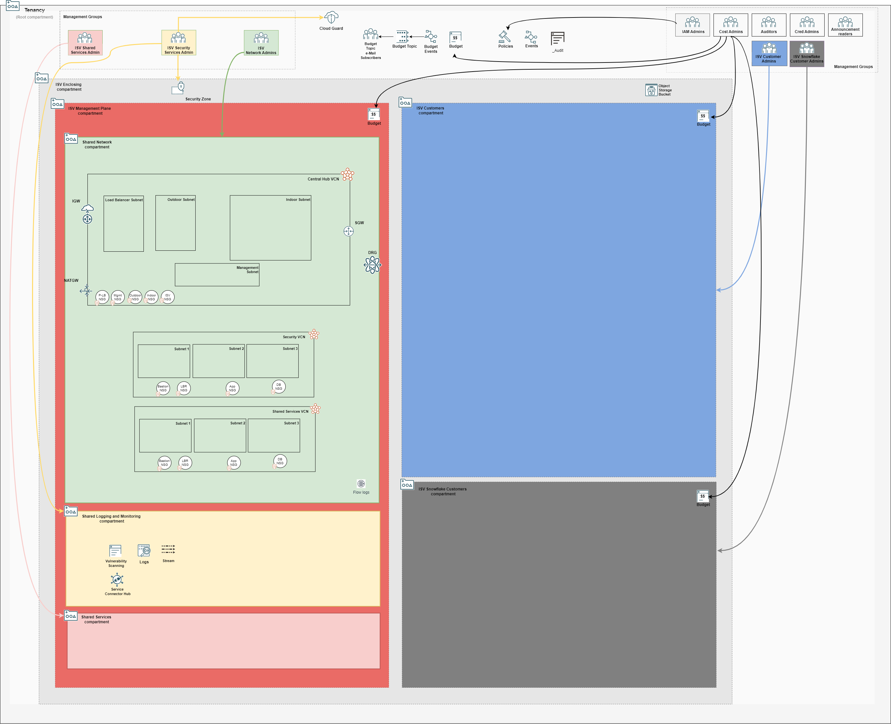
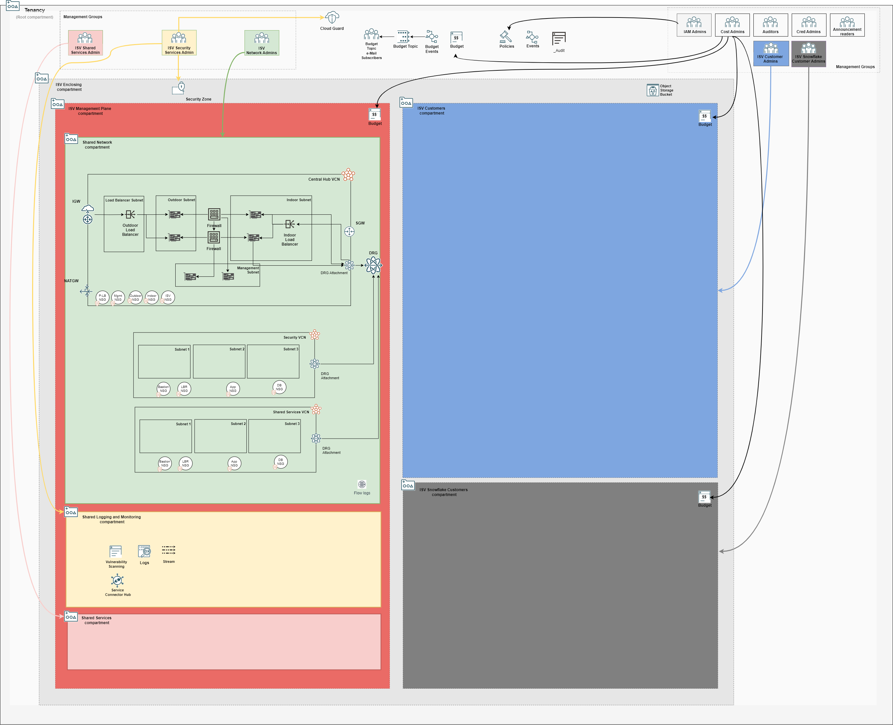

## Management Plane Network Stack Deployment

The network stack manages the management plane networking configuration, including all the routing to customer VCNs.

### Typically Deployed By

Management plane network administrators.

### Deployment Order

This stack is executed in different stages with a **PROGRESSIVELY UPDATED single input configuration file**.

- [**1st stage**](#1st-stage): after the [Foundational stack](./MPLANE-FOUNDATIONAL.md).
- [**2nd stage**](#2nd-stage): after the [Firewall stack](./MPLANE-FIREWALL.md)

**AT THIS STAGE THE MANAGEMENT PLANE IS CONSIDERED READY TO ONBOARD CUSTOMERS.**

- [**Subsequent stages**](#3rd-stage): after each customer onboarding stack. 

### <a name="1st-stage">Network Stack 1st Stage</a> 

#### Stack Configuration

Input Configuration Files | Input Dependency Files | Output
--------------------------|------------------------|-------
[network_initial_config.json](../mgmt-plane/network/network_initial_config.json) | iam/output/compartments_output.json | network/output/network_output.json

#### Stack Creation

Click the button to create the stack with all variables pre-filled.

[](https://cloud.oracle.com/resourcemanager/stacks/create?zipUrl=https://github.com/oracle-quickstart/terraform-oci-landing-zones-orchestrator/archive/refs/heads/urls-dep-source.zip&zipUrlVariables={"input_config_files_urls":"https://raw.githubusercontent.com/andrecorreaneto/oci-landing-zone-configuration/test/mgmt-plane/network/network_initial_config.json","url_dependency_source_oci_bucket":"isv-terraform-runtime-bucket","url_dependency_source":"ocibucket","url_dependency_source_oci_objects":"iam/output/compartments_output.json","save_output":true,"oci_object_prefix":"network/output"})

#### What Gets Deployed




### <a name="2nd-stage">Network Stack 2nd Stage</a>

**THE 2ND STAGE IS NOT A NEW STACK, BUT AN UPDATE TO NETWORK STACK INITIAL DEPLOYMENT, NOW INCLUDING THE CONFIGURATIONS DEPLOYED BY THE NETWORK FIREWALL STACK.**

**AFTER THIS STAGE THE MANAGEMENT PLANE IS CONSIDERED READY TO ONBOARD CUSTOMERS.**

This stage updates the initial network configuration with route rules to the Network Load Balancer and the DRG. 

Specifically:

1. A new route table **is added** for routing any traffic to the Network Load Balancer.
```
"HUB-INGRESS-ROUTE" : {
    "display_name" : "central-hub-vcn-ingress-route",
    "route_rules" : {
        "TO-ANYWHERE-RULE" : {
            "description"        : "All traffic goes to NLB.",
            "destination"        : "0.0.0.0/0",
            "destination_type"   : "CIDR_BLOCK",
            "network_entity_key" : "INDOOR-NLB"
        }
    }
}
```              

2. All DRG attachments **are added**, with the attachment to the Firewall VCN (Central Hu VCN) referring to the route table above.

```
"drg_attachments" : {
    "CENTRAL-HUB-VCN-ATTACH" : {
        "display_name" : "central-hub-vcn-attachment",
        "drg_route_table_key" : "HUB-VCN-DRG-ROUTE",
        "network_details" : {
            "attached_resource_key" : "CENTRAL-HUB-VCN",
            "type" : "VCN",
            "route_table_key" : "HUB-INGRESS-ROUTE"
        }
    },
    "SECURITY-VCN-ATTACH" : {
        "display_name" : "security-vcn-attachment",
        "drg_route_table_key" : "SECURITY-VCN-DRG-ROUTE",
        "network_details" : {
            "attached_resource_key" : "SECURITY-VCN",
            "type" : "VCN"
        }
    },
    "SHARED-SERVICES-VCN-ATTACH" : {
        "display_name" : "shared-services-vcn-attachment",
        "drg_route_table_key" : "SHARED-SERVICES-VCN-DRG-ROUTE",
        "network_details" : {
            "attached_resource_key" : "SHARED-SERVICES-VCN",
            "type" : "VCN"
        }
    }
}
```
3. DRG route tables associated with Import route distributions **are added**:

```
"drg_route_tables" : {
    "HUB-VCN-DRG-ROUTE" : { 
        "display_name" : "central-hub-drg-route",
        "import_drg_route_distribution_key" : "HUB-IMPORT-ROUTE-DISTRIBUTION"
    },
    "SECURITY-VCN-DRG-ROUTE" : { 
        "display_name" : "security-vcn-drg-route",
        "import_drg_route_distribution_key" : "SECURITY-VCN-IMPORT-ROUTE-DISTRIBUTION"
    },
    "SHARED-SERVICES-VCN-DRG-ROUTE" : { 
        "display_name" : "shared-services-vcn-drg-route",
        "import_drg_route_distribution_key" : "SHARED-SERVICES-VCN-IMPORT-ROUTE-DISTRIBUTION"
    }
}
```

4. DRG Import route distributions **are added**, for the dynamic learning of route rules:

```
"drg_route_distributions" : {
    "HUB-IMPORT-ROUTE-DISTRIBUTION" : {
        "display_name" : "central-hub-vcn-route-distribution",
        "distribution_type" : "IMPORT",
        "statements" : {
            "SECURITY-VCN-STMT" : {
                "action" : "ACCEPT",
                "priority" : 1,
                "match_criteria" : {
                    "match_type" : "DRG_ATTACHMENT_ID",
                    "attachment_type" : "VCN",
                    "drg_attachment_key" : "SECURITY-VCN-ATTACH"
                }
            },    
            "SHARED-SERVICES-VCN-STMT" : {
                "action" : "ACCEPT",
                "priority" : 2,
                "match_criteria" : {
                    "match_type" : "DRG_ATTACHMENT_ID",
                    "attachment_type" : "VCN",
                    "drg_attachment_key" : "SHARED-SERVICES-VCN-ATTACH"
                }
            }
        }     
    },
    "SECURITY-VCN-IMPORT-ROUTE-DISTRIBUTION" : {
        "display_name" : "security-vcn-route-distribution",
        "distribution_type" : "IMPORT",
        "statements" : {
            "CENTRAL-HUB-VCN-STMT" : {
                "action" : "ACCEPT",
                "priority" : 1,
                "match_criteria" : {
                    "match_type" : "DRG_ATTACHMENT_ID",
                    "attachment_type" : "VCN",
                    "drg_attachment_key" : "CENTRAL-HUB-VCN-ATTACH"
                }
            }
        }
    },
    "SHARED-SERVICES-VCN-IMPORT-ROUTE-DISTRIBUTION" : {
        "display_name" : "shared-services-vcn-route-distribution",
        "distribution_type" : "IMPORT",
        "statements" : {
            "CENTRAL-HUB-VCN-STMT-2" : {
                "action" : "ACCEPT",
                "priority" : 1,
                "match_criteria" : {
                    "match_type" : "DRG_ATTACHMENT_ID",
                    "attachment_type" : "VCN",
                    "drg_attachment_key" : "CENTRAL-HUB-VCN-ATTACH"
                }
            }
        }
    }
}
```

**THESE CONFIGURATION SNIPPETS ARE SHOWN HERE FOR CLARITY PURPOSES. THEY ARE ALL ALREADY ADDED IN [network_post_firewall_config.json](../mgmt-plane/network/network_post_firewall_config.json).**

#### Updated Stack Configuration

In order to update the initial network configuration, edit the existing network stack, replacing the existing Input Configuration File and Input Dependency Files with the files in the table below:

Input Configuration Files | Input Dependency Files | Output
--------------------------|------------------------|-------
[network_post_firewall_config.json](../mgmt-plane/network/network_post_firewall_config.json) | iam/output/compartments_output.json, firewall/output/instances_output.json  | network/output/network_output.json

#### What Gets Deployed




### <a name="3rd-stage">Network Stack 3rd Stage</a>

**THE 3RD STAGE IS NOT A NEW STACK, BUT AN UPDATE TO THE NETWORK STACK AFTER EACH CUSTOMER ONBOARDING INITIATION.**

At this stage, the Central Hub VCN is updated for routing traffic to the newly added customer VCN. 

Specifically:

1. A new route rule **is added** to the Indoor subnet route table. This enforces routing through the DRG for any traffic that leaves the subnet destined to the newly added customer VCN.

```
"TO-CUSTOMER-1-VCN-RULE" : {
    "description"        : "To DRG.",
    "destination"        : "10.0.0.0/25", # newly added customer VCN CIDR range
    "destination_type"   : "CIDR_BLOCK",
    "network_entity_key" : "CENTRAL-HUB-DRG"
}
```

2. A new import route distribution statement **is added** to Central Hub VCN Import Route Distribution.

```
"CUSTOMER-1-VCN-STMT" : {
    "action" : "ACCEPT",
    "priority" : 3, ######  INCREMENT THIS FOR EACH NEWLY ADDED CUSTOMER.
    "match_criteria" : {
        "match_type" : "DRG_ATTACHMENT_ID",
        "attachment_type" : "VCN",
        "drg_attachment_key" : "CUSTOMER-1-VCN-ATTACH"
    }
}
```
**THESE CONFIGURATION SNIPPETS ARE SHOWN HERE FOR CLARITY PURPOSES. THEY ARE ALL ALREADY ADDED IN [network_post_each_customer_config.json](../mgmt-plane/network/network_post_each_customer_config.json)**

**MAKE SURE TO REPEAT STEPS 1 and 2 ABOVE FOR ANY NEWLY ADDED CUSTOMERS. UTILIZE AVAILABLE CUSTOMER 1 SAMPLE AS GUIDANCE.**

#### Updated Stack Configuration

In order to update the current network configuration, edit the existing network stack, replacing the existing Input Configuration File and Input Dependency Files with the files in the table below:

Input Configuration Files | Input Dependency Files | Output
--------------------------|------------------------|-------
[network_post_each_customer_config.json](../mgmt-plane/network/network_post_each_customer_config.json) | iam/output/compartments_output.json, firewall/output/instances_output.json, customers/customer1/  | network/output/network_output.json

#### What Gets Deployed

Routing is updated.